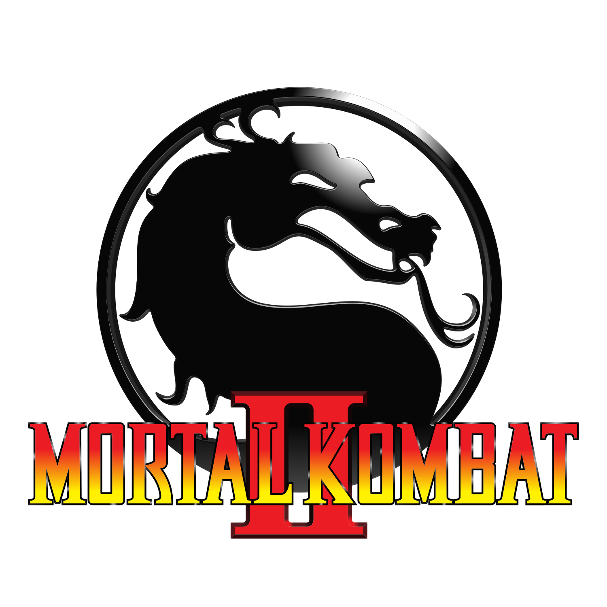

# Mortal Kombat Logo SVG Remaster
Original logo and MK1 cabinet art credit to [John Tobias](https://twitter.com/therealsaibot?lang=en) (concept and design) and [Paul Niemeyer](https://www.facebook.com/paul.e.niemeyer) (final line art). Line art remastered in Adobe Illustrator using the Mortal Kombat (Gameboy) box art (mkgb_cover.jpg) for reference.

## HD Render
Modelled in SolidWorks and rendered in Keyshot 9.

